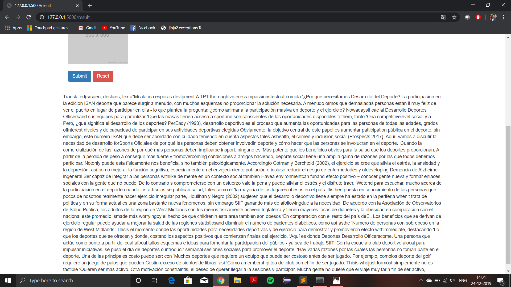

<b><h1><I>Image to OCR text & Speech Application using python</I></h2></b>

Web application is created using Flask(python).

<b>Python Libraries used here are</b>  
<ul>
  <li>pytesseract</li>
  <li>gTTS</li>
  <li>Google Translator</li>
  <li>python-vlc</li>
</ul>

<b><u>Installation Required</u></b>
  
<ul>
  <li>pip install Flask</li>
  <li>pip install pytesseract</li>
  <li>pip install python-vlc</li>
  <li>pip install Flask-Uploads</li>
  <li>pip install Flask-Bootstrap4</li>
</ul>
 
<u>Screenshots of the web-application</u> 
 
 
 
